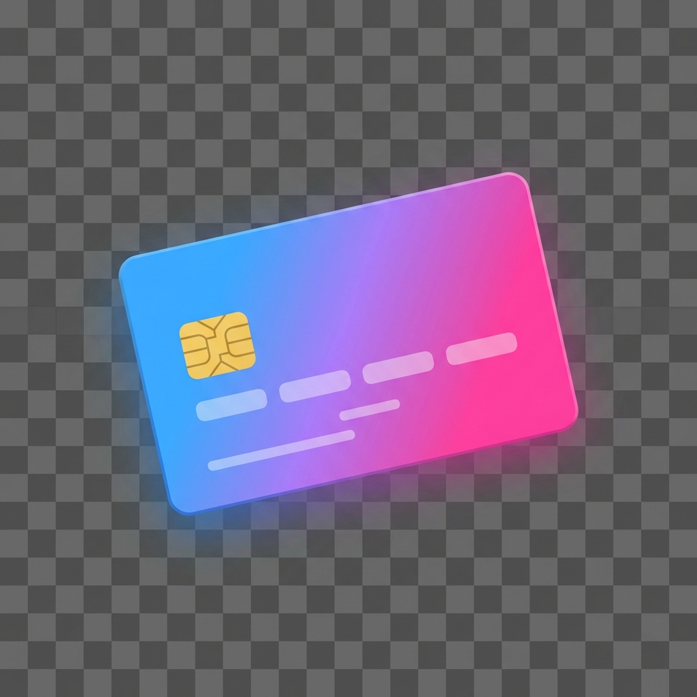

<p align="center">
  
</p>

<h1 align="center">Nudlers</h1>

<p align="center">
  <strong>Your Personal Finance Command Center for Israeli Banking</strong>
</p>

<p align="center">
  <em>Automatically aggregate, categorize, and analyze your finances from all Israeli banks and credit cards in one beautiful dashboard.</em>
</p>

<p align="center">
  <a href="#-features">Features</a> •
  <a href="#-quick-start">Quick Start</a> •
  <a href="#-supported-institutions">Banks & Cards</a> •
  <a href="#-ai-integrations">AI Integration</a> •
  <a href="#-documentation">Documentation</a>
</p>

---

## Why Nudlers?

Managing finances across multiple Israeli banks and credit cards is a nightmare. Different apps, different formats, no unified view. **Nudlers solves this.**

| The Problem | The Nudlers Solution |
|-------------|---------------------|
| Scattered data across 5+ apps | One unified dashboard |
| Manual transaction logging | Automatic daily sync |
| No cross-bank insights | AI-powered analysis |
| Time wasted on categorization | Smart auto-categorization |
| Missed budget alerts | WhatsApp notifications |

---

## ✨ Features

### 📊 Unified Financial Dashboard

See all your money in one place. Nudlers aggregates transactions from every Israeli bank and credit card into a single, beautiful interface.

- **Multi-View Analytics** — Switch between Summary, Budget, Category, and Recurring Payment views
- **Real-Time Sync** — Background syncing keeps your data fresh automatically
- **Custom Billing Cycles** — Track spending by your credit card billing cycle, not just calendar months
- **Installment Tracking** — Monitor ongoing installments with remaining payments and amounts

### 🧠 Intelligent Auto-Categorization

Stop wasting time manually categorizing transactions. Nudlers learns your spending patterns.

**3-Phase Smart Categorization:**
1. **Rule-Based Matching** — Custom regex patterns for merchants you define
2. **Historical Learning** — Remembers how you categorized "Aroma Coffee" and applies it automatically
3. **Selective Enrichment** — Only fetches additional data when needed, avoiding bot detection

> 95%+ of transactions are categorized automatically after initial setup

### 📱 Native WhatsApp Integration

Get your daily financial summary delivered right to WhatsApp — no Twilio, no third-party services.

- **Daily Summaries** — Wake up to yesterday's spending overview
- **Budget Alerts** — Know when you're approaching limits
- **Group Support** — Share summaries with family or partners
- **QR Code Setup** — Connect in seconds, stays connected forever

### 🤖 AI-Powered Insights

Ask questions about your finances in plain language using Google Gemini integration.

```
"What did I spend on groceries this month?"
"Compare my dining expenses to last month"
"Show me my top 10 expenses"
```

### 🔌 MCP Integration for AI Assistants

Connect Nudlers directly to **Claude Desktop** or **Cursor** using the Model Context Protocol.

```json
{
  "mcpServers": {
    "nudlers": {
      "command": "npx",
      "args": ["-y", "supergateway@latest", "--sse", "http://localhost:6969/api/mcp"]
    }
  }
}
```

Now your AI assistant can query your finances, search transactions, and even add manual expenses.

### 💰 Smart Budget Management

Set budgets by category and track them in real-time.

- **Visual Progress Bars** — See budget consumption at a glance
- **Burndown Charts** — Daily spending vs. ideal pace visualization
- **Historical Comparison** — Compare this month to previous months
- **Overspend Alerts** — Get notified before you exceed limits

### 🔒 Bank-Grade Security

Your credentials never leave your machine unencrypted.

- **AES-256-GCM Encryption** — Industry-standard encryption for all credentials
- **Local Processing** — No cloud service sees your bank passwords
- **Secure by Design** — Credentials decrypted only at scraping time

### 🍓 Runs Anywhere

From powerful servers to a Raspberry Pi — Nudlers adapts to your hardware.

| Mode | Target Hardware | RAM Usage |
|------|----------------|-----------|
| **Normal** | Servers, PCs | 2GB+ |
| **Low** | Synology NAS, QNAP | 1GB |
| **Ultra-Low** | Raspberry Pi | 512MB |

---

## 🏦 Supported Institutions

### Banks
| | | | |
|:---:|:---:|:---:|:---:|
| **Hapoalim** | **Leumi** | **Mizrahi Tefahot** | **Discount** |
| **FIBI** | **Yahav** | **Otsar Hahayal** | **Beinleumi** |
| **Massad** | **Union** | **Jerusalem** | **Pepper** |

### Credit Cards
| | | | |
|:---:|:---:|:---:|:---:|
| **Visa Cal** | **Max (Leumi Card)** | **Isracard** | **American Express** |

---

## 🚀 Quick Start

### Prerequisites

- **Docker** (recommended) OR Node.js 22+ with PostgreSQL 16+
- **Google Chrome** (for scraping, included in Docker)

### Option 1: Docker (Recommended)

```bash
# Clone the repository
git clone https://github.com/enudler/nudlers.git
cd nudlers

# Configure environment
cp .env_example .env
# Edit .env with your database password and encryption key

# Start everything
docker-compose up -d
```

**Generate your encryption key:**
```bash
node -e "console.log(require('crypto').randomBytes(32).toString('hex'))"
```

Open **http://localhost:3000** and start adding your accounts!

### Option 2: NAS / Server (Pre-built Image)

For Synology, QNAP, or any server with Docker:

```bash
# Create deployment directory
mkdir nudlers && cd nudlers

# Download production configs
curl -O https://raw.githubusercontent.com/enudler/nudlers/main/docker-compose.prod.yaml
curl -O https://raw.githubusercontent.com/enudler/nudlers/main/.env_example

# Configure and start
cp .env_example .env
# Edit .env with your settings
docker-compose -f docker-compose.prod.yaml up -d
```

Supports both `linux/amd64` and `linux/arm64` architectures.

### Option 3: Manual Installation

```bash
# Clone and install
git clone https://github.com/enudler/nudlers.git
cd nudlers/app
npm install

# Configure PostgreSQL and .env file
# See Environment Variables section below

# Run
npm run dev
```

---

## ⚙️ Configuration

### Environment Variables

| Variable | Required | Description |
|----------|:--------:|-------------|
| `NUDLERS_DB_USER` | ✅ | PostgreSQL username |
| `NUDLERS_DB_HOST` | ✅ | Database host (`nudlers-db` for Docker) |
| `NUDLERS_DB_NAME` | ✅ | Database name |
| `NUDLERS_DB_PASSWORD` | ✅ | Database password |
| `NUDLERS_DB_PORT` | | Database port (default: `5432`) |
| `NUDLERS_ENCRYPTION_KEY` | ✅ | 64-character hex key for credential encryption |
| `NUDLERS_AUTH_PASSWORD` | ✅ | Application login password |
| `GEMINI_API_KEY` | | Google Gemini API key for AI features |
| `RESOURCE_MODE` | | `normal`, `low`, or `ultra-low` (default: `normal`) |

### Application Settings

All settings are configurable through the **Settings UI** (gear icon in navigation):

| Category | Settings |
|----------|----------|
| **Sync** | Enable/disable, sync hour, days to fetch |
| **Display** | Currency, date format, billing cycle start day |
| **Scraper** | Timeout, show browser (debugging), category fetching |
| **AI** | Gemini API key, model selection |
| **WhatsApp** | Enable, send hour, recipients, summary mode |

---

## 🤖 AI Integrations

### Built-in AI Assistant

The built-in chat uses Google Gemini to answer questions about your finances:

- "What's my budget status for groceries?"
- "Show me all transactions from Rami Levy"
- "How much did I spend on dining this month vs last month?"

**Setup:** Add your `GEMINI_API_KEY` in Settings or `.env`

### MCP for Claude Desktop / Cursor

Nudlers exposes a Model Context Protocol endpoint that AI assistants can use directly.

**Setup for Claude Desktop:**

Add to your Claude Desktop MCP config (`~/.config/claude/claude_desktop_config.json`):

```json
{
  "mcpServers": {
    "nudlers": {
      "command": "npx",
      "args": ["-y", "supergateway@latest", "--sse", "http://localhost:6969/api/mcp"]
    }
  }
}
```

**Available Tools:**
- `get_monthly_summary` — Financial summaries by vendor
- `search_transactions` — Find specific transactions
- `get_recurring_payments` — List subscriptions and installments
- `add_manual_expense` — Add transactions via AI
- `get_category_breakdown` — Spending by category

---

## 💡 Smart Categorization Explained

Nudlers uses a unique 3-phase approach to achieve high accuracy while avoiding bot detection:

```
┌─────────────────────────────────────────────────────────────────────┐
│                        PHASE 1: Hybrid Scrape                        │
│  Fetch transactions WITHOUT categories (avoids bot detection)        │
└────────────────────────────────┬────────────────────────────────────┘
                                 │
                                 ▼
┌─────────────────────────────────────────────────────────────────────┐
│                     PHASE 2: Local Matching                          │
│  ┌──────────────────┐    ┌──────────────────────────────────────┐   │
│  │   Custom Rules   │ -> │  If no match, check historical cache │   │
│  │  (Regex-based)   │    │   "Aroma" -> "Dining" (from history) │   │
│  └──────────────────┘    └──────────────────────────────────────┘   │
└────────────────────────────────┬────────────────────────────────────┘
                                 │
                                 ▼
┌─────────────────────────────────────────────────────────────────────┐
│                  PHASE 3: Selective Enrichment                       │
│  Only for remaining uncategorized: targeted API calls (low risk)     │
└─────────────────────────────────────────────────────────────────────┘
```

This approach provides:
- **Speed** — Most transactions categorized instantly from cache
- **Accuracy** — 95%+ categorization rate
- **Safety** — Minimal API calls prevent account lockouts

---

## 📱 WhatsApp Integration

### How It Works

Nudlers uses a headless browser to connect to WhatsApp Web — no third-party services required.

### Setup

1. Go to **Settings** → **WhatsApp Daily Summary**
2. Click **Start WhatsApp Service**
3. Scan the QR code with your phone (WhatsApp → Linked Devices)
4. Configure recipients (phone numbers or group IDs)
5. Set your preferred delivery time

### Docker Configuration

For Docker deployments, add these to your `docker-compose.yaml`:

```yaml
services:
  nudlers-app:
    volumes:
      - whatsapp-data:/app/.wwebjs_auth  # Persist session
    cap_add:
      - SYS_ADMIN
    security_opt:
      - seccomp=unconfined
    shm_size: '2gb'

volumes:
  whatsapp-data:
```

---

## 🛠️ Troubleshooting

### "Block Automation" Errors (Isracard/Max/Amex)

These vendors have aggressive bot detection. Solutions:

1. **Use Low Resource Mode** — Set `RESOURCE_MODE=low` to reduce browser footprint
2. **Reduce Sync Days** — Lower `sync_days_back` to 7-14 days
3. **Manual Login** — Log in to the vendor website once to clear notices
4. **Wait** — If blocked, wait 24 hours before retrying

### Chrome Not Found

For custom environments:
```env
PUPPETEER_EXECUTABLE_PATH=/usr/bin/google-chrome
```

### WhatsApp QR Code Not Appearing

1. Check browser capabilities in Docker config
2. Ensure `shm_size` is at least `1gb`
3. Check logs: `docker-compose logs -f nudlers-app`

---

## 🏗️ Architecture

```
nudlers/
├── app/                          # Next.js application
│   ├── components/               # React UI components
│   │   ├── CategoryDashboard/    # Main dashboard views
│   │   ├── Layout.tsx            # App shell with navigation
│   │   └── ...
│   ├── pages/
│   │   ├── api/                  # 59 API endpoints
│   │   │   ├── transactions/     # Transaction CRUD
│   │   │   ├── scrapers/         # Scraper control
│   │   │   ├── reports/          # Financial reports
│   │   │   ├── mcp/              # MCP integration
│   │   │   └── ...
│   │   └── index.tsx
│   ├── scrapers/                 # Bank scraper logic
│   ├── utils/                    # Shared utilities
│   └── styles/                   # Theming (light/dark mode)
├── docker-compose.yaml           # Local development
├── docker-compose.prod.yaml      # Production deployment
└── db-init/                      # Database initialization
```

### Tech Stack

| Layer | Technology |
|-------|------------|
| **Framework** | Next.js 16 (Pages Router) |
| **Language** | TypeScript |
| **Database** | PostgreSQL 16 |
| **UI** | Material-UI v6, CSS Variables |
| **Scraping** | israeli-bank-scrapers, Puppeteer |
| **AI** | Google Gemini, MCP SDK |
| **Messaging** | whatsapp-web.js |
| **Testing** | Vitest, Playwright |

---

## 🧪 Development

```bash
cd app

# Install dependencies
npm install

# Start development server (port 6969)
npm run dev

# Run tests
npm run test

# Run linter
npm run lint

# Start Storybook (port 6006)
npm run storybook
```

---

## 🔄 Updating

### Docker

```bash
docker-compose pull
docker-compose up -d
```

### Manual

```bash
git pull
cd app
npm install
npm run build
npm start
```

Database migrations run automatically on startup.

---

## 📄 License

**Polyform Noncommercial License 1.0.0**

Free for personal, non-commercial use. For commercial licensing, please contact the author.

See [LICENSE](LICENSE) for full terms.

---

## 🙏 Credits

- **Bank Scraping**: [israeli-bank-scrapers](https://github.com/eshaham/israeli-bank-scrapers)
- **UI Framework**: [Material-UI](https://mui.com/)
- **WhatsApp Integration**: [whatsapp-web.js](https://github.com/pedroslopez/whatsapp-web.js)

---

<p align="center">
  <strong>Take control of your Israeli finances.</strong>
  <br>
  <a href="https://github.com/enudler/nudlers">Star on GitHub</a> •
  <a href="https://github.com/enudler/nudlers/issues">Report Issues</a>
</p>
