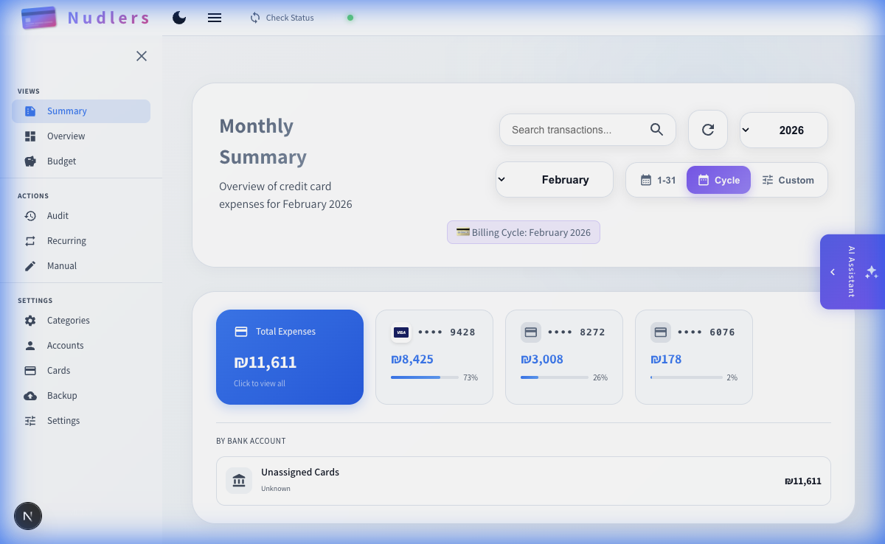
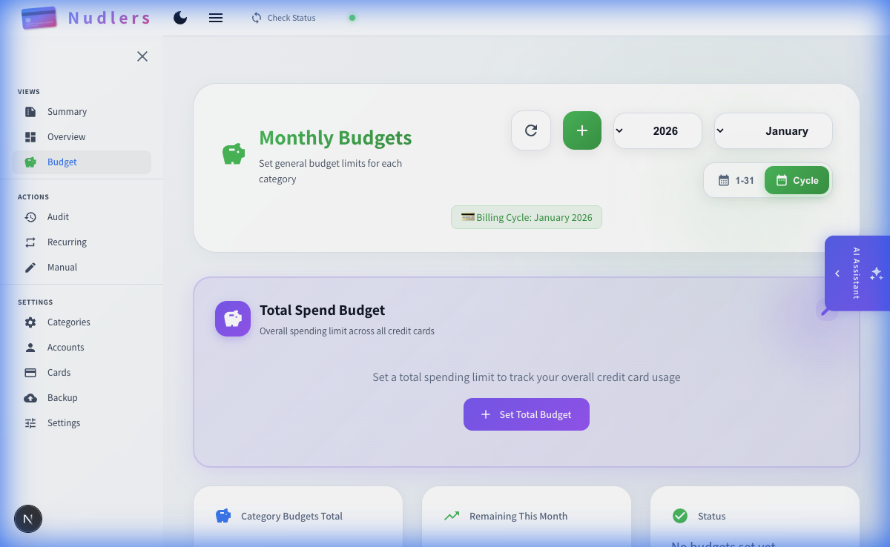
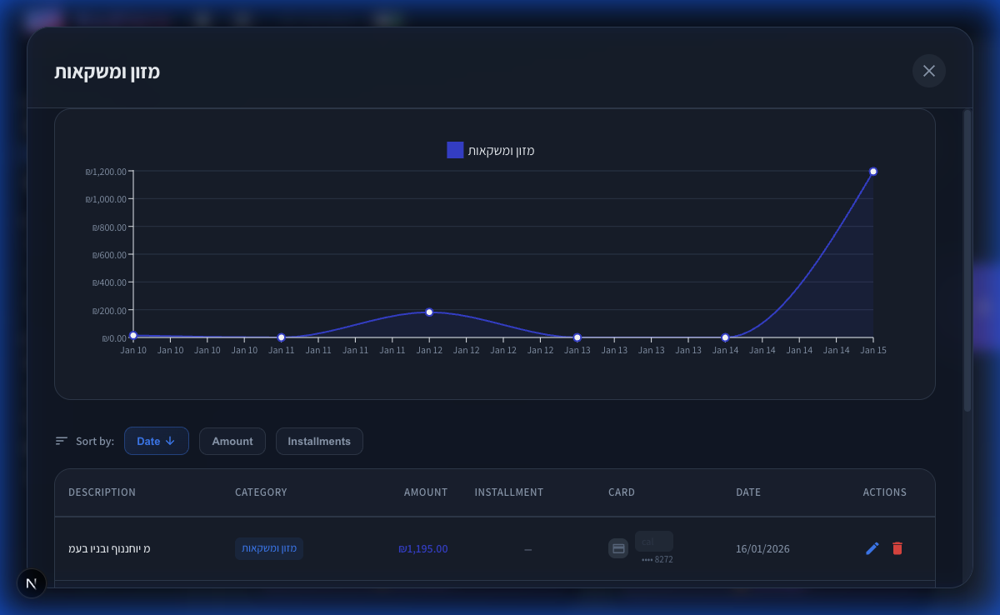
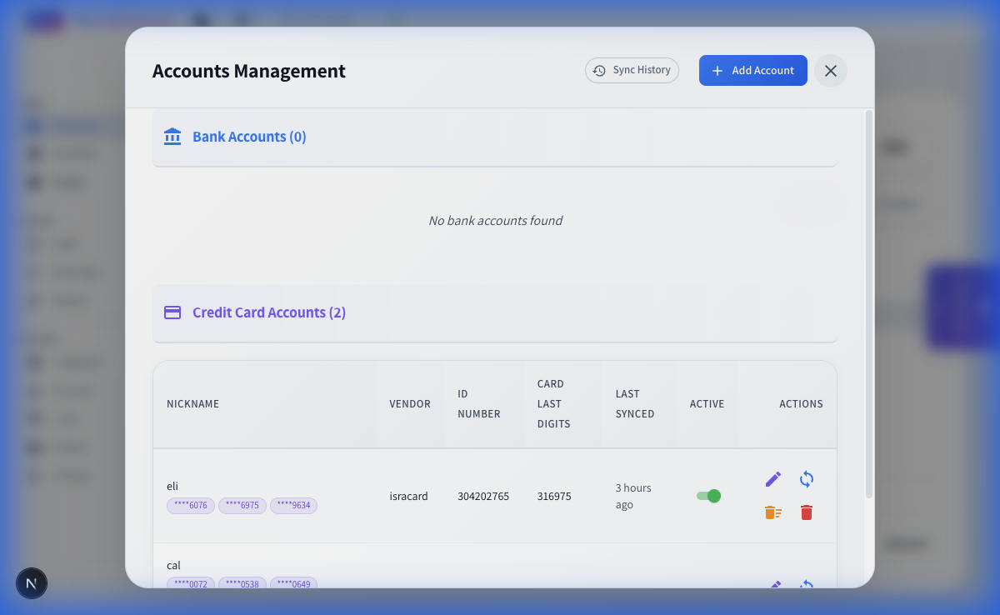
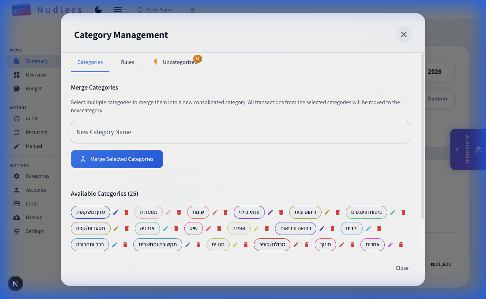
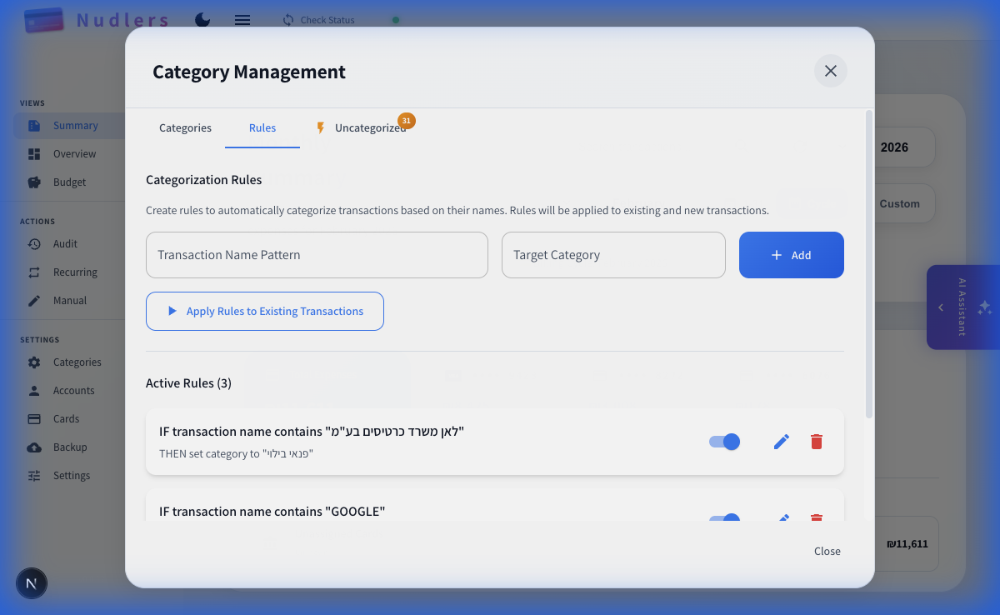
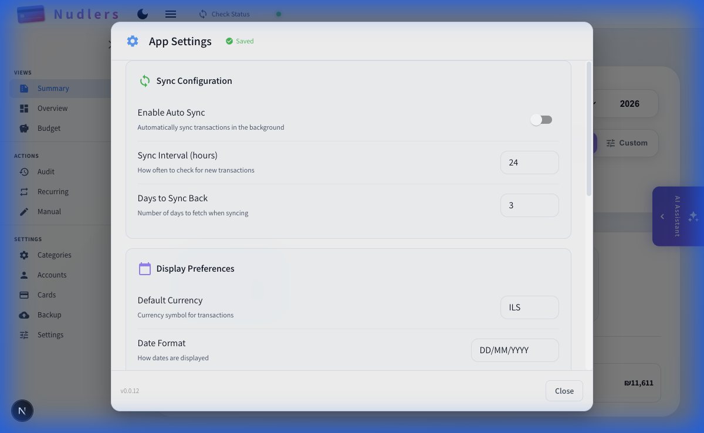
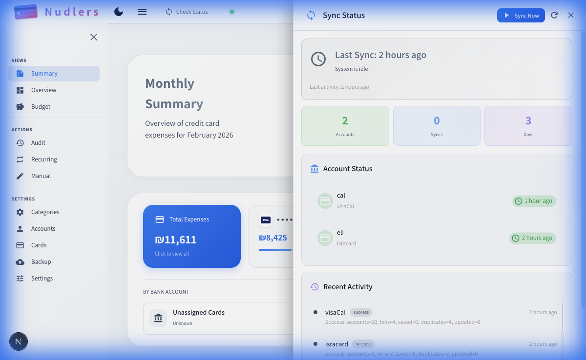
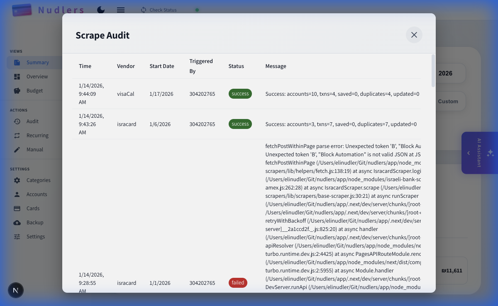
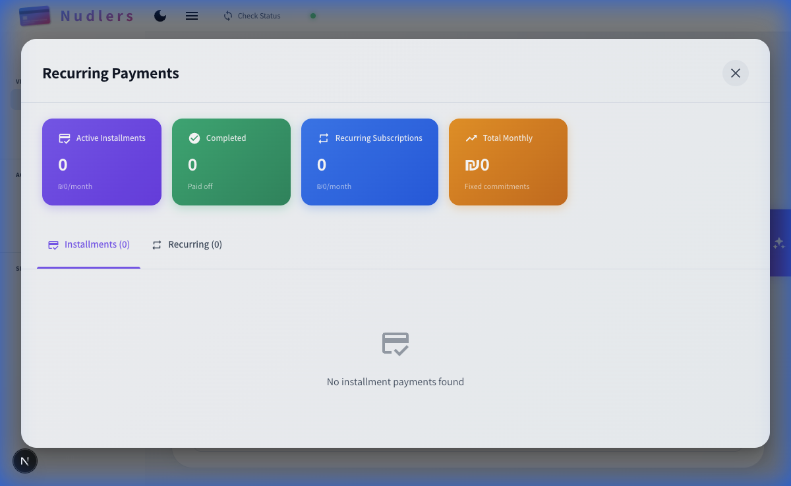

# Nudlers

Personal finance management application for tracking credit card expenses and bank transactions with automatic categorization.

**Stack:** Next.js · PostgreSQL · TypeScript · Material-UI

---

## Features

### 📊 Financial Overview & Tracking
- **Multi-view Dashboard** with Summary, Overview, and Budget perspectives
- **Real-time financial snapshots** showing total expenses across all accounts
- **Bank & credit card transaction tracking** with automatic synchronization
- **Monthly billing cycle management** with customizable cycle start dates
- **Expense trend visualization** with interactive charts and graphs

### 💳 Account Management
- 🏦 **Automatic bank & credit card scraping** (Israeli financial institutions)
- **Multi-account support** for both bank accounts and credit cards
- **Account nicknames** for easy identification
- **Card ownership tracking** to assign cards to specific users
- **Last sync status** and sync history for each account
- **Sync interval configuration** (automatic background sync every N hours)

### 📝 Transaction Management
- **Manual transaction entry** for cash purchases and income
- **Transaction editing** with category reassignment
- **Transaction deletion** with confirmation dialogs
- **Installment tracking** for split payments
- **Search and filter** transactions by description, amount, category, or date
- **Transaction source tracking** (scraper vs. manual entry)

### 🎯 Categorization & Rules
- 📊 **Category-based tracking** and spending analytics
- ⚙️ **Customizable categorization rules** for automatic transaction labeling
- **Pattern-based auto-categorization** using transaction descriptions
- **Category merging** to consolidate similar categories
- **Category renaming** to organize your finances
- **Rule management** to apply categorization to existing transactions
- **Uncategorized transaction tracking** with indicators

### 💰 Budgeting & Analytics
- **Monthly budget setting** per category
- **Budget vs. actual spending** comparison
- **Total spend budget** across all credit cards
- **Category budget totals** and remaining amounts
- **Budget performance tracking** with visual indicators

### 🔄 Sync & Automation
- **Automatic background sync** at configurable intervals
- **Catch-up sync** to retrieve transactions from last sync date
- **Configurable sync history** (days to sync back)
- **Retry configuration** for failed sync attempts
- **Update category on re-scrape** option
- **Real-time sync status** with live updates
- **Sync history and audit logs** for all scraping operations

### 🔍 Advanced Features
- 🔐 **Secure authentication** with encrypted credentials (AES-256-GCM)
- 💡 **AI-powered insights** using Google Gemini (optional)
- **Recurring payment detection** and tracking
- **Database backup & restore** with export/import functionality
- **Scrape audit logs** with detailed sync reports
- **Dark/light theme** support
- **Responsive design** for mobile and desktop
- **Multi-currency support** with configurable default currency
- **Customizable date formats**

---

## Screenshots

### Main Views

<table>
  <tr>
    <td><br/><sub><b>Monthly Summary</b> - Overview of credit card expenses for the month</sub></td>
    <td><br/><sub><b>Financial Overview</b> - Bank transactions and expense categories</sub></td>
  </tr>
  <tr>
    <td><br/><sub><b>Budget Dashboard</b> - Set and track spending limits per category</sub></td>
    <td><br/><sub><b>Category Details</b> - Transaction timeline and detailed expense view</sub></td>
  </tr>
</table>

### Management & Configuration

<table>
  <tr>
    <td><br/><sub><b>Account Management</b> - Add and manage bank accounts and credit cards</sub></td>
    <td><br/><sub><b>Category Management</b> - Merge, rename, and organize categories</sub></td>
  </tr>
  <tr>
    <td><br/><sub><b>Categorization Rules</b> - Auto-categorize transactions with pattern matching</sub></td>
    <td><br/><sub><b>App Settings</b> - Configure sync, display preferences, and more</sub></td>
  </tr>
</table>

### Sync & Tracking

<table>
  <tr>
    <td><br/><sub><b>Sync Status</b> - Real-time account sync status and recent activity</sub></td>
    <td><br/><sub><b>Scrape Audit</b> - Detailed logs of all scraping operations</sub></td>
  </tr>
  <tr>
    <td><br/><sub><b>Recurring Payments</b> - Track installment and subscription payments</sub></td>
    <td></td>
  </tr>
</table>


---

## Quick Start

### Prerequisites

- Node.js 22+
- PostgreSQL 16+
- Google Chrome (for scraping)

### Option 1: Docker (Recommended)

```bash
# Clone the repository
git clone https://github.com/enudler/nudlers.git
cd nudlers

# Copy and configure environment variables
cp .env_example .env
# Edit .env with your values

# Start the application
docker-compose up -d
```

Open http://localhost:3000

### Option 2: NAS / Server Deployment (Pre-built Image)

For NAS or server deployment, use the pre-built Docker image from GitHub Container Registry:

```bash
# Create a directory for the deployment
mkdir nudlers && cd nudlers

# Download the production docker-compose and env template
curl -O https://raw.githubusercontent.com/enudler/nudlers/main/docker-compose.prod.yaml
curl -O https://raw.githubusercontent.com/enudler/nudlers/main/.env_example

# Configure environment variables
cp .env_example .env
# Edit .env with your values (REQUIRED: NUDLERS_DB_PASSWORD, NUDLERS_ENCRYPTION_KEY)

# Start the application
docker-compose -f docker-compose.prod.yaml up -d
```

**To update to the latest version:**
```bash
docker-compose -f docker-compose.prod.yaml pull
docker-compose -f docker-compose.prod.yaml up -d
```

The database schema is automatically created and migrated on app startup - no manual initialization required!

The image supports both `linux/amd64` and `linux/arm64` architectures.

### Option 3: Manual Setup

1. **Clone and install dependencies**
   ```bash
   git clone https://github.com/enudler/nudlers.git
   cd nudlers/app
   npm install
   ```

2. **Configure environment variables**
   
   Create `.env` in the root directory:
   ```env
   NUDLERS_DB_USER=myuser
   NUDLERS_DB_HOST=localhost
   NUDLERS_DB_NAME=nudlers
   NUDLERS_DB_PASSWORD=mypassword
   NUDLERS_DB_PORT=5432
   NUDLERS_ENCRYPTION_KEY=<64-char-hex>
   NUDLERS_AUTH_PASSWORD=<your-password>
   ```
   
   Generate encryption key:
   ```bash
   node -e "console.log(require('crypto').randomBytes(32).toString('hex'))"
   ```

3. **Initialize the database**
   ```bash
   psql -U myuser -d nudlers -f db-init/init.sql
   ```

4. **Run the application**
   ```bash
   npm run dev
   ```
   
   Open http://localhost:3000

---

## Environment Variables

| Variable | Description |
|----------|-------------|
| `NUDLERS_DB_USER` | PostgreSQL username |
| `NUDLERS_DB_HOST` | Database host (use `nudlers-db` for Docker) |
| `NUDLERS_DB_NAME` | Database name |
| `NUDLERS_DB_PASSWORD` | Database password |
| `NUDLERS_DB_PORT` | Database port (default: 5432) |
| `NUDLERS_ENCRYPTION_KEY` | 64-character hex key for credential encryption |
| `NUDLERS_AUTH_PASSWORD` | Application login password |
| `GEMINI_API_KEY` | (Optional) Google Gemini API key for AI features |

---

## Supported Financial Institutions

### Credit Cards
- Visa Cal
- Max (Leumi Card)
- Isracard
- American Express (Israel)

### Banks
- Bank Hapoalim
- Bank Leumi
- Mizrahi Tefahot
- Discount Bank
- Bank Yahav
- First International Bank (FIBI)
- Otsar Hahayal
- Massad
- Bank Pagi

---

## Architecture

```
nudlers/
├── .github/workflows/      # CI/CD pipelines
│   └── docker-build.yml    # Build & push Docker image
├── app/                    # Next.js application
│   ├── components/         # React components
│   ├── pages/
│   │   ├── api/           # API routes
│   │   │   ├── utils/     # Shared utilities
│   │   │   └── ...        # API endpoints
│   │   └── index.tsx      # Main page
│   └── public/            # Static assets
├── db-init/               # Database initialization scripts
├── docker-compose.yaml    # Docker config (local development)
├── docker-compose.prod.yaml # Docker config (production/NAS)
└── .env_example           # Environment template
```

---

## API Endpoints

### Scraping
- `POST /api/scrape` - Scrape a single account
- `POST /api/scrape_stream` - Scrape with real-time progress updates (SSE)
- `POST /api/catchup_sync` - Smart sync from last transaction date

### Transactions
- `GET /api/month_by_categories` - Get spending by category for a month
- `GET /api/category_expenses` - Get expenses for a specific category
- `GET /api/monthly_summary` - Get monthly financial summary
- `POST /api/manual_transaction` - Add a manual transaction

### Categories
- `GET /api/get_all_categories` - List all categories
- `POST /api/rename_category` - Rename a category
- `POST /api/merge_categories` - Merge categories
- `POST /api/apply_categorization_rules` - Apply auto-categorization rules

### Credentials
- `GET /api/credentials` - List saved credentials
- `POST /api/credentials` - Add new credentials
- `DELETE /api/credentials/[id]` - Remove credentials

---

## Troubleshooting

### Isracard/Amex/Max "Block Automation" Error

These vendors have aggressive bot detection. The app includes mitigations:

- **Category caching**: Known descriptions are mapped to categories locally
- **Rate limiting delays**: 3-8 second random delays between requests
- **Extended timeouts**: 3 minutes for these vendors
- **Anti-detection measures**: Browser fingerprint spoofing

**If you still encounter issues:**

1. Wait 24-48 hours between sync attempts
2. Sync one account at a time
3. Try logging into the website manually first
4. Reduce the date range being synced

### Database Connection Issues

1. Verify PostgreSQL is running: `docker-compose ps`
2. Check environment variables match your setup
3. For Docker, ensure the database container is healthy

### Chrome/Chromium Not Found

The scraper needs Chrome. Install it or set the path:
```env
PUPPETEER_EXECUTABLE_PATH=/path/to/chrome
```

---

## Development

```bash
# Install dependencies
cd app && npm install

# Run in development mode
npm run dev

# Build for production
npm run build
npm start
```

---

## License

MIT License - See [LICENSE](LICENSE) file for details.

---

## Credits

- Bank scraping: [`israeli-bank-scrapers`](https://github.com/eshaham/israeli-bank-scrapers)
- UI Framework: [Material-UI](https://mui.com/)
